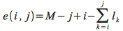
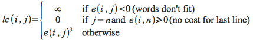

**Due: Wed, Mar 22nd in class** Late assignments will be penalized 20% per day.

Book Questions from *Introduction to Algorithms - 3rd ed.*
==========================================================

15.1-2

15-4 (10 points)

16.1-4 (10 points)

B.4-1

*Hints:*

> 15.1-2 - Consider the following rod pricing table
>
> length |  1  |  2  |  3  |  4  |
> ------ | --- | --- | --- | --- |
> price  |  1  | 20  | 33  | 36  |
>
> Compute the density *p*i/*i* for each length, determine the greedy solution and compare it to the optimal solution.
>
> 15-4 - This problem is *tricky* (as if any dynamic programming problem isn't). To start, define a quantity *e(i,j)* that tracks the number of extra spaces at the end of a line as
>
> 
>
> Then the cost of a line *lc(i,j)* is given by
>
> 
>
> Let the optimal cost for *n* words be *c(n)* and give a *top-down* recursive formula for *c(n)*. Then show *optimal substructure* for the recursion and give a *bottom-up* implementation.  
>
> 16.1-4 - We have discussed the activity scheduling problem for the case of maximizing the number of activities for a *single lecture hall*. Consider how to use this strategy to schedule *each* activity in the *minimum* number of halls. There is a straightforward approach which produces an O(n2). Try to find a **better** solution utiizing a stack and priority queue to solve the problem in O(n lg n) time (consider sorting both start *and* finish times). Remember you must *prove* (at least intuitively) that your approach produces an *optimal* solution.
>
> B.4-1 - Represent each handshake as an edge in a graph. Consider the adjacency list representation for the graph and the total number of edges in *all* the lists.
